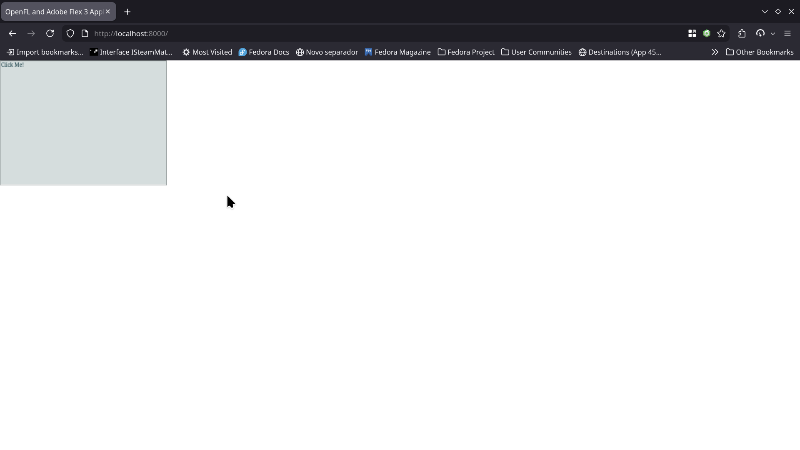

# Flex 3 on Apache Royale  
Currently very work in progress!  
  
  
  
TODO:
- [ ] Add support for old code generation (`-compiler.mxml.childre-as-data`) to compiler-jx for the JS Target so that the documentDescriptor is automatically made (allows for MXML to actually define children)  
- [ ] Figure out why styling is broken
- [ ] Test more Components once some of them work...
  
Building:
You need openfl-js built from [this fork](https://github.com/fancy2209/openfl-js/tree/Starling) built with openfl-haxelib from [this fork](https://github.com/fancy2209/openfl/tree/flex). You also need to use the Apache Royale Compiler 0.9.13/1.0.0 (at the time of writing this, this release isn't out so you need to compile it from source).  
Build projects/haloclassic, then the main project!
